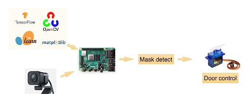

# FaceDetectionOnRaspberrypi4

저전력·저비용 마스크 착용 감지 자동문

가반 9팀

20150354 허기욱, 20170395 정윤성, 20210388 임세윤

------------

01  기대 효과

02  작업 환경

03  목표 및 제작 배경  

04  시스템 개요

05  구현 영상

--------------

목표

라즈베리파이4를 이용하여 저전력·저비용 마스크 착용 감지 자동문 구현

 => 자영업자들의 인건비 절감 및 무인 시스템점포 기초방역강화

제작배경

위드코로나로 인한 확진자 급증

=> 기초 방역의 중요성 강화 

무인 시스템 점포 증가 추세

=> 기초 방역의 허점 

-------------

시스템 개요

마스크 착용 / 미착용 데이터 학습 -> Dataset 구축 -> 연결된 웹캠 영상 전달 -> 마스크 착용 여부 확인 

-> 자동문 제어 -> 마스크 착용 / 미착용 데이터 학습

-------------
작업 환경

Raspberry Pi 4

Rasberry Pi OS 10 Buster

Python 3.7

Tensorflow-on-arm v2.4.0

OpenCV 4.1

----------------

구현 영상

https://youtu.be/lIt_zLLhP5E

docker link

https://hub.docker.com/repository/docker/kkambbak/myubuntu/general
